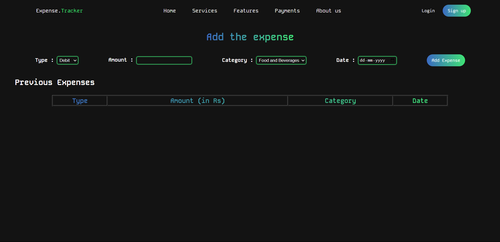

# **Expense Tracker Web Application**

This is a full-stack **Expense Tracker Web Application** built using **PHP** for the backend and **HTML, CSS, JavaScript** for the frontend. The application allows users to **sign up, log in, add expenses**, and **view their expenses**. It also supports **user authentication** using email and password.

## **Features**

- **User Authentication**: Users can sign up and log in to access their expenses.
- **Add Expenses**: Users can add new expenses by providing details like type, amount, category, and date.
- **View Expenses**: Users can view a list of their expenses.

## **Tech Stack**

- **Frontend**: HTML, CSS, JavaScript
- **Backend**: PHP
- **Database**: MySQL (for storing user data and expenses)

## **Team Members**

- **Pritidisha Samal** - 22BBS0188
- **Samarth Patel** - 22BBS0196
- **Chandan Kumar** - 22BBS0210

## **Course**: Modern Web Applications

## **Screenshots**

